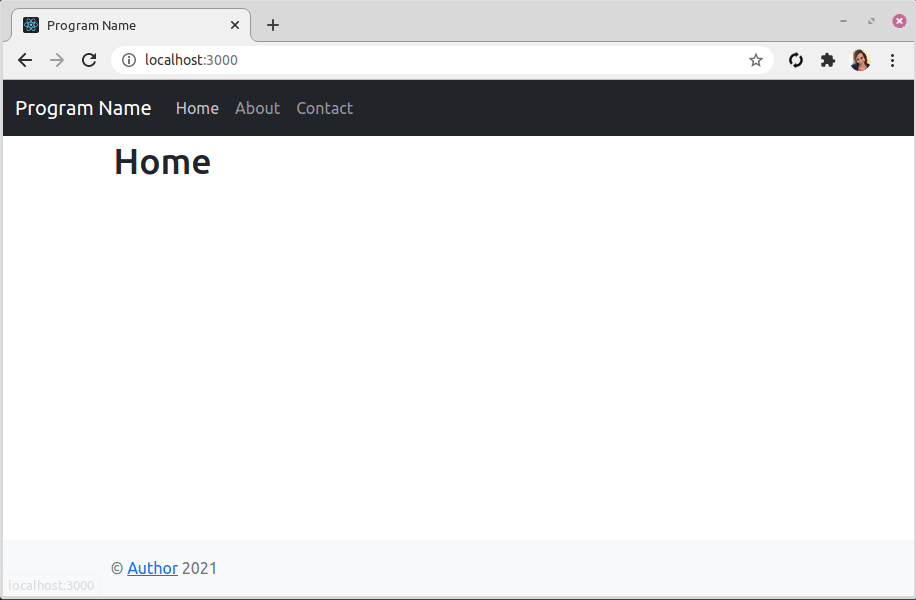

Node.js Bootstrap Express React Starter Template
===

A quick and easy Node.js + [Express](https://expressjs.com) + [React](https://reactjs.org) template project, using Twitter [Bootstrap](https://getbootstrap.com) 5.0 and React Router for creating a simple single page application.

Also available for [Pug](https://github.com/primaryobjects/Node.js-Bootstrap-Starter-Template).



## Usage

- Clone repository.
- Open a command prompt, navigate to the folder, and enter: `npm install`
- Navigate to the folder `client` and enter: `npm install`
- Next, run a build of the React client by entering: `npm run build`
- Launch the node server by navigating to the root folder and entering: `npm start`
- Browse to http://localhost:3000

### Development Usage

- Navigate to the folder `client` and enter: `npm start`

  This will run the React client app.

  You can make changes to the pages in `/client/src/components` and see them update live.

### Legacy OpenSSL Provider

If you receive an error: `export NODE_OPTIONS=--openssl-legacy-provider` use the following [steps](https://stackoverflow.com/a/69699772/2596404):

- Linux
```
export NODE_OPTIONS=--openssl-legacy-provider
```

- Windows

```
set NODE_OPTIONS=--openssl-legacy-provider
```

- PowerShell

```
$env:NODE_OPTIONS = "--openssl-legacy-provider"
```

## Contents:

- client/src/index.js
- client/src/App.js
- client/src/components/Header/index.js
- client/src/components/Footer/index.js
- client/src/components/Home/index.js
- client/src/components/About/index.js
- client/src/components/Contact/index.js
- client/src/components/NotFound/index.js

## Editing Pages:

Edit `client/src/components/Home/index.js` to add your content to the Home page. The default contents include:

```js
class Home extends Component {
  render() {
    return (
      <>
        <h1>Home</h1>
        <p>Home</p>
      </>
    )
  }
}
```

## Author
Kory Becker http://www.primaryobjects.com/kory-becker
